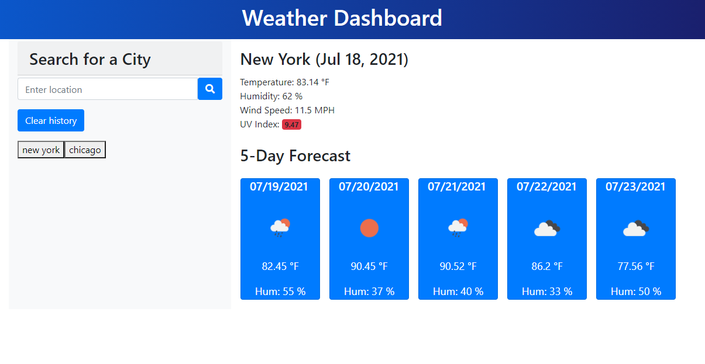

# Weather-App

## Purpose
To use the app, a user enters a name of the city to receieve the current weather and a five day forecast for whatever city they search. The current weather includes the current temperature, wind speed, relative humidity, and uv index. The forecast displays the daily maximum temperature, humidty, and wind speed. The goal was to build a weather dashboard that features dynamically updated HTML and CSS, powered by javascript. OpenWeather One Call API was implemented to retrieve weather data for cities, allowing the user to search for any city and receive the current weather and a five day forecast.

##Challenges and Areas for improvement
The OpenWeather One Call API which was specified for the assignment only takes lat and long as input, so a different endpoint was used to get the current weather. The response from the current weather call was then used to get the latitude and longitude, which were necessary to get not only the daily forecasts (from the One Call endpoint) but also the uv index data. Another challenge was managing local storage so that the list of buttons from previous searches didn't contain repeats or non-valid search terms.
Areas for improvement:
It would make more sense to display both min and max temps in the forecast cards.
The previous search buttons currently are not being displayed with the css rules applied to them, their appearance could be refined.
The responsive layout could use some improvement.

## Built with
* HTML
* CSS
* Javascript
* Moment
* Bootstrp

## Website
https://kait-weishaar.github.io/Weather-App/

## Contribution
* HTML, CSS, and Javascript by Kait Weishaar
